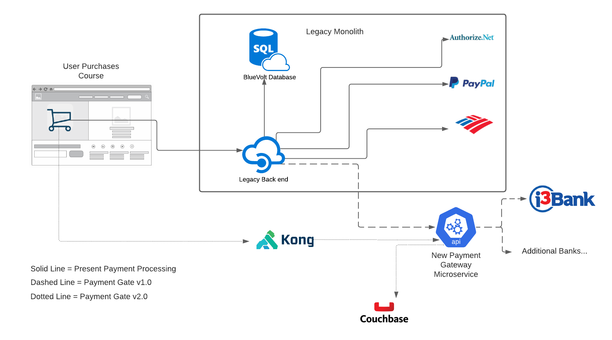

# BlueVolt Payment Gateway API Spec V1


## Background

Historically, the BlueVolt code base was implemented as a single 'monolith'.  As we add new services and capabilities, we are looking to stand these up as microservices.   This will enable us to more rapidly implement new features, deploy new versions of components individually, and implement a more 'resilient' system (if certain services are block or unavailable, other services can continue to function).

The payment gateway/payment processing component of the BlueVolt system is an example of a service we wish to stand up as an independent microservice.  Initially, the plan is to cause minimum disruption to currently implemented payment methods.  Therefore, as payment requests are received by the legacy back end, if it determines that a new payment gateway is being utilized, it will forward those requests to the microservice.

The current payment gateway backend supports three payment gateway types: Authorize.Net, PayPal via PayFlow Pro, and Band of America Payment Gateway. The merchant account data is stored in the existing BlueVolt database and the Legacy Back End handles payments, refunds, and database updates for the merchant account. 

A customer must create a merchant account with one of the supported payment gateways and then create the merchant account within our system and link it to their university. This process will likely remain until a new UI/UX is created. 

Payment Gateway API V1 will not support any database interaction. The Legacy Back End will continue to handle any database interaction and send http requests to the API to submit transactions and request refunds. 




## Overview

The BlueVolt backend has a specific structure for each payment gateway. Currently, each gateway type supports two functions, SubmitSale() and SubmitCredit(). Each gateway type has different requirements and methods to submit a transaction. 

The SubmitSale() function will be used to launch a transaction request to the new Payment Gateway API. This occurs when a user purchases a course or training track.

The SubmitCredit() function will be used to launch a refund request to the new Payment Gateway API. This occurs when a user unenrolls from a course or training track and they are issued a refund. 

In order to integrate with the existing system, the Payment Gateway API must be flexible and scalable. Adding new payment gateways should be as easy as possible and the API should be designed to properly support new gateways with minimal updates. The Payment Gateway API is designed with these requirements in mind. 


## Conventions

In the payload specifications set forth below, parameters specified as optional may not be required to complete the transaction

. The < and > symbols themselves should NOT be included in the respective payloads.  If multiple possible values are supported, these shall be separated by a vertical bar (|). Only one such value should be present in any given message. Comments, if present, are at the end of a line and are preceded by a hashtag (#).


### BVMeta Header

In order to track transactions through our system, we will require a BVMeta header. This header will store data that is not required for the request but _is_ needed for logging purposes. There is a platform-logging-standards.docx file in the Engineering SharePoint that further outlines logging and the BVMeta header requirement. This header will be a requirement in all endpoints.

```
{ 
   "transactionId": <GUID | uuid4>,    #stringified
   "universityId": <int>,  
   "userId": <int> 
}  
```

- **transactionId** is a uuid4 generated at the start of the transaction, this will not be changed once it has been created.
- **universityId** is the unique id for the university that the payment is being processed for.
- **userId** is the user id of the logged in user that is completing a payment transaction.


## Endpoints

#### /paymentGateway/processPayment

##### POST Method

###### URL Format:

/paymentGateway/processPayment


###### Headers:

- Content-Type: application/json
- BVMeta : {<BVMeta header described above>}


###### Body

```
{
  "gatewayTypeId": <int>,
  "gatewayTypeName": <str>,
  "merchantAccountId": <int>,
  "credentials": <dict>,
  "account": <str>,         # validation regex='[0-9]{15,16}'
  "expDate": <str>,         # validation regex='[0-9]{4}'
  "cvv2": <str>,            # validation regex='[0-9]{3,4}'
  "amount": <float>,
  "name": <str>,            # optional
  "street": <str>,          # optional
  "city": <str>,            # optional
  "state": <str>,           # optional
  "zip": <int>,             # optional
  "country": <str>,         # optional
  "comment": <str>,         # optional
  "userName": <str>,        # optional
  "userId": <int>,
  "currencyType": <CurrencyType enum>
}
```


- **gatewayTypeId** is the id that for the new gateway that is added to dbo.MicroservicePaymentGatewayAccountType table.
- **gatewayTypeName** is the name of the gateway type name stored in the dbo.MicroservicePaymentGatewayAcocuntType table.
- **merchantAccountId** is the MerchantAccountID for the merchant account in the MerchantAccount table.
- **credentials** is a dictionary of the required key: value pairs that are needed for the specific gateway type. See the credentials section in the Glossary.
- **account** is the credit card number for the transaction.
- **expDate** is the credit card expiration date. TODO: determine format
- **cvv2** is the credit card CVV2.
- **amount** is the transaction amount. 
- **name** is the card holder’s full name.
- **street** is the card holder's address street.
- **city** is the card holder's address city.
- **state** is the card holder's address state.
- **zip** is the card holder's address zip code.
- **country** is the card holder's address country.
- **comment** notes tied to the transaction.
- **userName** is the full name of the logged in user that is submitting the transaction. 
- **userID** is the UserID in dbo.Mem_User table for the logged in user submitting the transaction. 
- **currencyType** is an enum that maps to the currency type used in our system. Will appear as an integer in the payload. 


###### Response

- pass the same headers as the request
- JSON payload as response body

```
{
  "detail": {
    "success": <bool>, 				# true or false
    "statusCode": <str>,
    "gatewayHttpStatusCode", <int>,		    
    "responseMessage": <dynamic>,
    "responseDetail": <str>,
    "paymentTransactionId": <str>,
    “merchantAccountId”: <int>
  }
}
```

- **success** is a Boolean that determines whether the transaction was successful or not.
- **statusCode** is the status code of the payment gateway request.
- **gatewayHttpStatusCode** is the status code returned from the request to the payment gateway (such as Payload), and will be a http status code.
- **responseMessage** will either be a string or a dictionary containing the response from the payment gateway (such as payload).  
- **responseDetail** is the response message that is logged when a transaction is unsuccessful. Can also be a success message.
- **paymentTransactionId** is an id that is used to reference the payment transaction in the gateway. Will be stored as the PNREF value in the BlueVolt database.
- **merchantAccountId**  is the MerchantAccountID for the merchant account in the MerchantAccount table


#### /paymentGateway/processRefund

##### PATCH Method

###### URL Format:

/paymentGateway/processRefund


###### Headers:

- Content-Type: application/json
- BVMeta : {<BVMeta header described above>}

###### Body

```
{
  "gatewayTypeId": <int>,
  "gatewayTypeName": <str>,
  "merchantAccountId": <int>,
  "credentials": <dict>,
  "paymentTransactionId ": <str>,
  "comment": <str>,                   # optional
  "amount": <float>,                  # optional, if not included, the refund ammount will be the ammount of the original transaction
  "maskedCardNumber": <str>,          # optional
  "userId": <int>,
  "currencyType": <CurrencyType enum> # optional
}
```

- **gatewayTypeId** will be the id that for the new gateway that is added to dbo.MerchantAcountType table. The value will likely be 4 for the next gateway.
- **gatewayTypeName** will the name of the gateway type stored in the dbo.MerchantAccountType table.
- **merchantAccountId** is the MerchantAccountID for the merchant account in the MerchantAccount table.
- **credentials** will contain a dictionary of the required key: value pairs that are needed for the specific gateway type. See the credentials section in the Glossary.
- **paymentTransactionId** is an id that is used to reference the transaction in the system.
- **comment** notes tied to the refund. 
- **amount** is the refund amount. 
- **maskedCardNumber** is a masked card number used in the transaction that is being credited.
- **userId** is the user id for the user that is initiating the refund.
- **currencyType** is an enum that maps to the currency type used in our system. Will appear as an integer in the payload. 


###### Response

- pass the same headers as the request
- JSON payload as response body

```
{
  "detail": {
    "success": <bool>, 				# true or false
    "statusCode": <str>,
    "gatewayHttpStatusCode", <int>,		    
    "responseMessage": <dynamic>,
    "responseDetail": <str>,
    "paymentTransactionId": <str>,
    “merchantAccountId”: <int>
  }
}
```

- **success** is a Boolean that determines whether the transaction was successful or not.
- **statusCode** is the status code of the payment gateway request.
- **gatewayHttpStatusCode** is the status code returned from the request to the payment gateway (such as Payload), and will be a http status code.
- **responseMessage** will either be a string or a dictionary containing the response from the payment gateway (such as payload).  
- **responseDetail** is the response message that is logged when a transaction is unsuccessful. Can also be a success message.
- **paymentTransactionId** is an id that is used to reference the payment transaction in the gateway. Will be stored as the PNREF value in the BlueVolt database.
- **merchantAccountId**  is the MerchantAccountID for the merchant account in the MerchantAccount table


## Logging

All new microservices will adhere to a logging standard outlined in the platform-logging-standards.docx document. For the Payment Gateway API, we will want to log a single message per transaction, or endpoint call. This will allow us to track a transaction from the BVLMS monolith throughout the Payment Gateway microservice. The document mentioned above explains this at great length. A summary bellow will outline what is needed from the Payment Gateway.

###### Log Message Format

```
{
  "transactionId": <str>,
  "universityId": <int>,
  "userId": <int>,
  "level": "ERROR"|"AUDIT",
  "service": "PaymentGatewayAPI",
  "data": {
    gatewayTypeId: <int>,
    gatewayTypeName: <str>,
    merchantAccountId: <int>,
    userId: <int>,
    status: <str>[,]
    [paymentTransactionId: <str>,]
    [comment: <str>,]
    [amount: <float>,]
    [maskedCardNumber: <str>,]
    [currencyType: int]
  }
}
```

- The first five values in the log message, transactionId, universityId, userId, level, and service are all required fields.

- The data key has a dictionary of optional keys that are added to better understand the log message and what happened with that transaction. Keys surrounded by brackets are optional and may or may not be logged depending on what happened in the execution.


## Database

Payment Gateway V1 will not interact with the BlueVolt database. It will be up to the Legacy Back End to handle all database interaction and pass all required data to the Payment Gateway API.


## Glossary

###### CurrencyType enum:

Enum used throughout the system to determine the currency type. This is hardcoded in the Legacy Back End and also stored in the dbo.CurrencyType table in the BlueVolt Database. 

```c#
// From ISO 4217
public enum CurrencyType
{
    USD = 840,
    CAD = 124,
    GBP = 826,
    EUR = 978,
}
```


###### credentials:

For Payload.co:

```
{  
  "ProcessingId": <str>,
  "ApiKey": <str>
}  
```

- **ProcessingId** is the processing account resource id in Payload.
- **ApiKey** is the generated secret key for a Payload account.